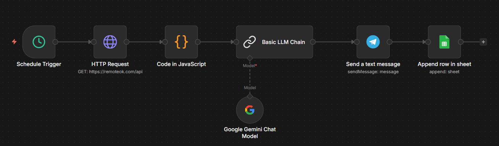
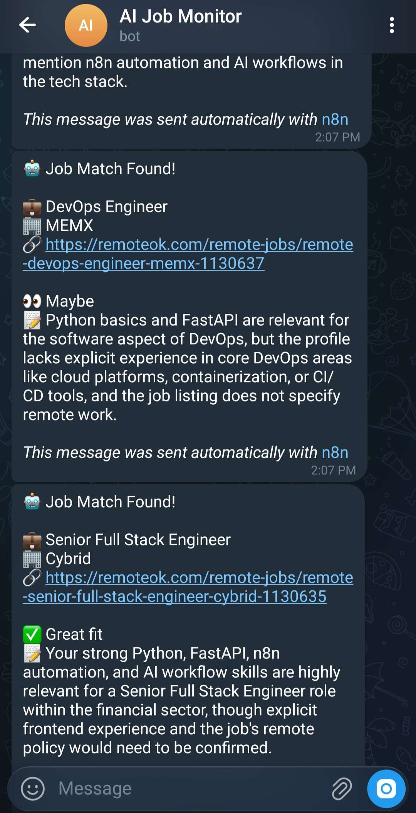
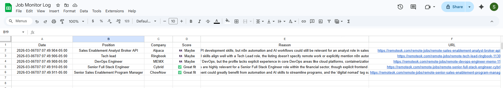

# AI Job Monitor Bot

Automatically finds remote AI/automation jobs every morning, scores them with AI, and sends only the best matches to Telegram.

## Flow

Runs daily at 9AM → fetches jobs from RemoteOK → filters by keywords →
AI scores each job as ✅ Great fit / 👀 Maybe / ❌ Skip →
only ✅ and 👀 jobs sent to Telegram → all results logged to Google Sheets

## Screenshots

### Workflow Canvas

### Telegram Messages

### Google Sheets Log

## Tech Stack

- n8n
- Google Gemini API
- Telegram Bot API
- Google Sheets API
- RemoteOK API

## How to Run

1. Install n8n locally
2. Import `workflow.json`
3. Connect Google Gemini API key
4. Connect your Telegram bot token
5. Connect Google Sheets account
6. Activate the workflow — runs automatically every day at 9AM
